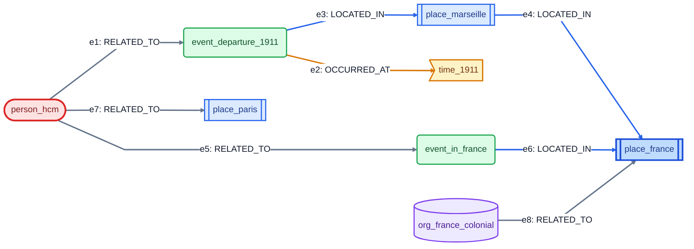

```mermaid
%%{init: {
  "theme": "base",
  "themeVariables": {
    "background": "#ffffff",
    "primaryTextColor": "#0f172a",
    "primaryBorderColor": "#475569",
    "lineColor": "#64748b",
    "fontFamily": "Inter, Arial, sans-serif",
    "fontSize": "16px",
    "edgeLabelBackground": "#ffffff",
    "tertiaryColor": "#f8fafc"
  },
  "flowchart": {
    "curve": "linear",
    "nodeSpacing": 64,
    "rankSpacing": 88,
    "htmlLabels": true
  }
}}%%

graph LR
    %% Định nghĩa các node và hình dáng theo loại thực thể
    P1([person_hcm])

    E1(event_departure_1911)
    E2(event_in_france)

    T1>time_1911]

    L1[[place_marseille]]
    L2[[place_france]]
    L3[[place_paris]]

    O1[(org_france_colonial)]

    %% Định nghĩa các cạnh và nhãn quan hệ
    P1 -->|e1: RELATED_TO| E1
    E1 -->|e2: OCCURRED_AT| T1
    E1 -->|e3: LOCATED_IN| L1
    L1 -->|e4: LOCATED_IN| L2
    P1 -->|e5: RELATED_TO| E2
    E2 -->|e6: LOCATED_IN| L2
    P1 -->|e7: RELATED_TO| L3
    O1 -->|e8: RELATED_TO| L2

    %% Màu sắc phân loại node
    classDef person fill:#fee2e2,stroke:#dc2626,stroke-width:3px,color:#7f1d1d
    classDef event fill:#dcfce7,stroke:#16a34a,stroke-width:2px,color:#14532d
    classDef time fill:#fef3c7,stroke:#d97706,stroke-width:2px,color:#78350f
    classDef place fill:#dbeafe,stroke:#2563eb,stroke-width:2px,color:#1e3a8a
    classDef focusPlace fill:#bfdbfe,stroke:#1d4ed8,stroke-width:3px,color:#1e3a8a
    classDef organization fill:#ede9fe,stroke:#7c3aed,stroke-width:2px,color:#4c1d95

    class P1 person
    class E1,E2 event
    class T1 time
    class L1,L3 place
    class L2 focusPlace
    class O1 organization

    %% Màu sắc phân loại relation
    linkStyle 0 stroke:#64748b,stroke-width:2.5px
    linkStyle 1 stroke:#d97706,stroke-width:2.5px
    linkStyle 2 stroke:#2563eb,stroke-width:2.5px
    linkStyle 3 stroke:#2563eb,stroke-width:2.5px
    linkStyle 4 stroke:#64748b,stroke-width:2.5px
    linkStyle 5 stroke:#2563eb,stroke-width:2.5px
    linkStyle 6 stroke:#64748b,stroke-width:2.5px
    linkStyle 7 stroke:#64748b,stroke-width:2.5px
```
