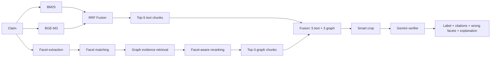

# KIỂM CHỨNG NHẬN ĐỊNH LỊCH SỬ VIỆT NAM BẰNG FACET GRAPH RAG

> Tài liệu nội dung trình bày khóa luận theo dạng slide. Mỗi dấu `---` tương ứng một slide.
>
> Số liệu chính sử dụng quy trình **no-leak**: tại thời điểm suy luận, hệ thống chỉ nhận `claim`; không sử dụng `key`, nhãn hoặc bằng chứng vàng.

**Sinh viên:** Nguyễn Duy Ân — 22127006 · Đỗ Lê Khoa — 22127195  
**Đề tài:** Hệ thống phát hiện thông tin sai lệch về lịch sử Việt Nam dựa trên tài liệu Trung học phổ thông

---

## 1. Bối cảnh và động lực

- Thông tin lịch sử trên Internet có thể bị sai lệch ở những chi tiết nhỏ nhưng quan trọng.
- Các lỗi thường gặp gồm:
  - sai nhân vật hoặc tổ chức;
  - sai năm, giai đoạn hoặc thứ tự sự kiện;
  - sai địa điểm;
  - đảo chiều hành động;
  - sai số lượng, nguyên nhân hoặc kết quả.
- LLM có thể trả lời trực tiếp nhưng khó kiểm soát nguồn và có thể dựa vào kiến thức tham số.
- RAG văn bản tìm được đoạn cùng chủ đề nhưng chưa chắc tìm được chi tiết quyết định.
- Knowledge Graph có khả năng biểu diễn thực thể, thời gian và quan hệ một cách có cấu trúc.

**Câu hỏi nghiên cứu:** Facet Graph có thể bổ sung bằng chứng và khả năng giải thích gì cho Hybrid RAG trong bài toán kiểm chứng lịch sử Việt Nam?

---

## 2. Phát biểu bài toán

### Đầu vào

Một nhận định lịch sử tiếng Việt:

> “Mặt trận Việt Minh được thành lập ngày 19/5/1942.”

### Đầu ra

Hệ thống cần sinh ba thành phần:

1. Nhãn `real` hoặc `fake`.
2. Các đoạn bằng chứng từ SGK Lịch sử 10–12.
3. Giải thích ngắn, chỉ ra khía cạnh đúng hoặc sai như `time`, `place`, `organization`, `action`.

### Ràng buộc chống rò rỉ dữ liệu

```text
Được dùng:     claim
Không được dùng: key, label, gold/relevant evidence
```

Các trường phục vụ sinh dữ liệu và đánh giá chỉ được giữ ở metadata đầu ra.

---

## 3. Dữ liệu sử dụng

### Tập nhận định sau làm sạch

| Thành phần | Số lượng |
|---|---:|
| Tổng số nhận định | 11.344 |
| `real` | 3.514 — 30,98% |
| `fake` | 7.830 — 69,02% |
| Số `key` duy nhất | 2.051 |
| Claim từ đề thi `His/MET` | 7.457 |
| Claim sinh/chuyển đổi từ nội dung SGK | 3.887 |

### Kho tài liệu

| Thành phần | Số lượng |
|---|---:|
| Tệp OCR ban đầu | 591 |
| Trang sau làm sạch | 571 |
| Section-aware chunks | 540 |
| Sách nguồn | Lịch sử 10, 11 và 12 |

Mỗi chunk lưu `book`, `chapter`, `section`, `pages`, `source_files`, `year_mentions` và nội dung văn bản.

---

## 4. Quy trình tổng thể của nghiên cứu

```text
                         ┌─ LLM-only
                         ├─ BM25
Claim ───────────────────┼─ Dense BGE-M3
                         ├─ Hybrid BM25 + BGE-M3 + RRF
                         └─ Hybrid + Facet Graph RAG
                                      │
                                      ▼
                          Ablation và phân tích lỗi
                                      │
                                      ▼
                   Graph giúp hoặc làm hại Hybrid khi nào?
```

Mọi kiến trúc được so sánh bằng cùng claim, cùng corpus và cùng bộ kiểm chứng Gemini 2.5 Flash.

---

## 5. Bảng so sánh các kiến trúc

| Kiến trúc | Cách lấy tri thức | Evidence đưa vào verifier | Điểm mạnh | Hạn chế | Vai trò |
|---|---|---|---|---|---|
| **LLM-only** | Không truy xuất | Không có | Đơn giản; đo kiến thức tham số | Không dẫn nguồn; có thể đoán | Lower baseline |
| **BM25** | Khớp từ khóa thưa | Top-5 chunks | Mạnh với tên riêng, niên đại | Yếu với paraphrase | Sparse baseline |
| **Dense BGE-M3** | Vector ngữ nghĩa | Top-5 chunks | Bắt tương đồng ngữ nghĩa | Có thể bỏ sót chi tiết từ vựng | Dense baseline |
| **Hybrid** | BM25 + BGE-M3 + RRF | Top-5 chunks | Kết hợp lexical và semantic | Evidence vẫn là văn bản phẳng | Baseline chính |
| **Hybrid + Facet Graph** | Hybrid text + facet-to-graph retrieval | 5 text + tối đa 3 graph chunks | Bổ sung evidence có cấu trúc; giải thích theo facet | Graph có thể tạo distractor | Kiến trúc đề xuất |

---

## 6. Kết quả so sánh kiến trúc chính

### Cùng tập balanced 2.000 claim, cùng verifier và smart crop

| Phương pháp | Accuracy | Macro-F1 | Recall `real` | Recall `fake` |
|---|---:|---:|---:|---:|
| LLM-only | 81,65% | 81,65% | 80,20% | 83,10% |
| Dense BGE-M3 | 84,60% | 84,55% | 79,00% | 90,20% |
| BM25 | 87,45% | 87,45% | 85,60% | 89,30% |
| **Hybrid** | **88,10%** | **88,10%** | 86,10% | **90,10%** |
| **Hybrid + Facet Graph** | **87,05%** | **87,05%** | **87,60%** | 86,50% |

### Nhận xét

- Hybrid đạt accuracy cao nhất trong năm kiến trúc chính.
- Graph tăng recall `real` thêm **1,5 điểm phần trăm**.
- Graph làm recall `fake` giảm **3,6 điểm phần trăm**.
- Chênh lệch accuracy Hybrid + Facet so với Hybrid là **−1,05 điểm**, `p ≈ 0,078`.

---

## 7. Kiến trúc tổng quan Hybrid + Facet Graph RAG



Kiến trúc có hai nhánh chạy song song:

- **Text branch:** tối ưu độ chính xác truy xuất.
- **Facet Graph branch:** bổ sung evidence và tín hiệu giải thích có cấu trúc.

---

## 8. Xây dựng corpus và Knowledge Graph — offline

```text
591 OCR files
   ↓ Unicode/whitespace cleaning
571 cleaned pages
   ↓ rule-based section detection + overlap
540 section-aware chunks
   ↓ schema-constrained Gemini extraction
entities + typed relations + source evidence
   ↓ entity alignment
3.599 canonical entities
   ↓ deterministic graph construction
4.139 nodes + 10.729 edges
   ↓ temporal indexing
297 unique years
```

Mọi relation edge đều giữ:

- `source_chunk`;
- `evidence_text`;
- `description`;
- `confidence`.

Graph dùng để điều hướng về nguồn văn bản, không thay thế SGK như một nguồn sự thật độc lập.

---

## 9. Cấu trúc Knowledge Graph

### Loại nút

| Loại nút | Số lượng |
|---|---:|
| DocumentChunk | 540 |
| Person | 294 |
| Organization | 427 |
| Event | 672 |
| Place | 503 |
| Time | 850 |
| Concept | 853 |

### Loại cạnh chính

```text
MENTIONS
PARTICIPATED_IN
OCCURRED_AT
LOCATED_IN
CAUSES
RESULTS_IN
BEFORE / AFTER
RELATED_TO
```

Trong 4.867 relation semantic, 2.973 cạnh là `RELATED_TO`. Đây là một hạn chế lớn vì cạnh này biểu diễn liên quan chủ đề nhưng không đủ mạnh để chứng minh support hoặc contradiction.

---

## 10. Claim được xử lý như thế nào?

```text
Raw claim
   ↓ normalize Unicode và khoảng trắng
   ↓ không nối key, label hoặc gold evidence
Facet extraction
   ↓
person / organization / event / place / time
concept / quantity / action / result
   ↓
Facet matching vào graph
   ↓
Evidence retrieval và reranking
```

Ví dụ:

```json
{
  "claim": "Mặt trận Việt Minh được thành lập ngày 19/5/1942.",
  "facets": {
    "organization": ["Mặt trận Việt Minh"],
    "event": ["thành lập Mặt trận Việt Minh"],
    "time": ["19/5/1942"],
    "action": ["thành lập"]
  }
}
```

Facet là tín hiệu truy xuất; giá trị facet không được xem là đúng chỉ vì xuất hiện trong claim.

---

## 11. Vì sao sử dụng 9 loại facet?

| Facet | Ý nghĩa | Ánh xạ graph |
|---|---|---|
| `person` | Nhân vật lịch sử | Person |
| `organization` | Tổ chức, lực lượng, nhà nước | Organization |
| `event` | Sự kiện, hội nghị, chiến dịch | Event |
| `place` | Địa điểm, khu vực | Place |
| `time` | Năm, ngày, giai đoạn | Time + temporal index |
| `concept` | Chính sách, học thuyết, khái niệm | Concept |
| `quantity` | Số lượng, tỉ lệ | Phục vụ kiểm chứng/giải thích |
| `action` | Hành động hoặc vai trò | Phục vụ kiểm chứng/giải thích |
| `result` | Kết quả, hệ quả | Phục vụ kiểm chứng/giải thích |

Sáu facet đầu làm cầu nối claim–graph. Ba facet sau giúp verifier chỉ ra chi tiết sai nhưng hiện chưa được biểu diễn đầy đủ thành node hoặc relation trong graph.

---

## 12. Facet extraction

### Đầu vào

Chỉ sử dụng nội dung `claim`.

### Phương pháp

1. Trích các tín hiệu tất định như năm, số lượng và alias có trong graph.
2. GPT-4o-mini phân rã ngữ nghĩa claim thành tối đa chín loại facet.
3. Chuẩn hóa JSON và giới hạn số giá trị cho từng facet.
4. Cache kết quả để các thí nghiệm sau dùng cùng một facet input.

### Đầu ra

```text
claim_facets.json
```

Việc cache facet giúp:

- giảm chi phí API;
- giữ input thống nhất giữa các run;
- cô lập đóng góp của retrieval và fusion.

---

## 13. Facet matching vào graph

Mỗi giá trị facet được đối sánh theo thứ tự:

```text
1. Exact alias match
2. Normalized alias match
3. Year-index match
4. Substring fallback
```

Ví dụ:

```text
Facet: "Quốc dân Đảng"
Alias graph: "Việt Nam Quốc dân Đảng"
→ substring fallback
```

Các cơ chế kiểm soát:

- bỏ alias quá ngắn;
- giới hạn số node match cho mỗi facet;
- ưu tiên match chính xác;
- lưu `match_method` và `mention_count` để audit.

---

## 14. Graph evidence retrieval

Từ các node match được, hệ thống tìm source chunks theo ba đường:

1. **Node mention:** chunk chứa trực tiếp entity.
2. **Temporal index:** chunk/node/edge liên quan đến năm trong claim.
3. **Relation 1-hop:** chunk nguồn của quan hệ nối node claim với node lân cận.

Các relation được xét:

```text
PARTICIPATED_IN, OCCURRED_AT, LOCATED_IN,
CAUSES, RESULTS_IN, BEFORE, AFTER, RELATED_TO
```

Mỗi evidence candidate giữ:

- chunk và nội dung SGK;
- facet nào đã đưa nó vào candidate pool;
- node và relation liên quan;
- năm, sách, bài và trang nguồn.

---

## 15. Facet-aware reranking

Điểm evidence được tính theo:

```text
score(e) =
    0,45 × facet_coverage
  + 0,25 × relation_score
  + 0,20 × temporal_score
  + 0,10 × text_overlap
```

Sau đó áp dụng hub penalty:

```text
final_score = score / (1 + λ × log(1 + hub_frequency))
```

### Ý nghĩa

- `facet_coverage`: evidence phủ được bao nhiêu facet của claim.
- `relation_score`: evidence đến từ typed relation hay chỉ node mention.
- `temporal_score`: năm evidence có trùng claim hay không.
- `text_overlap`: mức trùng token giữa claim và chunk.
- `hub penalty`: giảm điểm các chunk chung chung bị tái sử dụng quá nhiều.

---

## 16. Nhánh Hybrid text retrieval

### BM25

- Mạnh với tên riêng, sự kiện và niên đại.
- Truy xuất top-20 lexical candidates.

### BGE-M3

- Mã hóa claim và chunk thành vector đa ngôn ngữ.
- Truy xuất top-20 semantic candidates.

### Reciprocal Rank Fusion

```text
RRF(d) = Σ 1 / (60 + rank_i(d))
```

- Không cần chuẩn hóa BM25 score và dense score về cùng thang đo.
- Chọn top-5 text chunks cho cấu hình chính.

---

## 17. Fusion text và graph evidence

### Cấu hình ban đầu

```text
3 text + 3 graph
```

Vấn đề: graph chiếm chỗ text rank 4–5; gold hit giảm mạnh.

### Cấu hình chính thức

```text
5 text + tối đa 3 graph
max_total_evidence = 8
```

Nguyên tắc:

- text top-5 được giữ nguyên;
- graph chỉ bổ sung, không thay thế text trong kiến trúc chính;
- evidence trùng chunk được deduplicate;
- mỗi evidence giữ `source_branch = text|graph` để phân tích đóng góp.

---

## 18. Smart crop và evidence presentation

Chunk có thể dài hơn context hữu ích của verifier. Cắt 1.400 ký tự đầu từng làm mất phần evidence quyết định ở cuối chunk.

### Smart crop

```text
Chia chunk thành các cửa sổ chồng lấp
→ tính claim-token overlap
→ chọn cửa sổ có overlap cao nhất
→ đưa tối đa 1.400 ký tự vào prompt
```

Mỗi evidence được trình bày kèm:

```text
[E1] chunk_id, book, pages, section
scores
facet_hits
relation_hits
years
source text window
```

Smart crop nâng gold-in-context từ khoảng 59,5% lên 85,5% trong phân tích ablation.

---

## 19. Verifier và đầu ra hệ thống

Gemini 2.5 Flash nhận:

1. Claim.
2. Claim facets.
3. Facet retrieval summary.
4. Tối đa tám evidence đã fusion và smart crop.

Quy tắc prompt:

- chỉ dựa trên evidence được cung cấp;
- so sánh rõ thời gian, địa điểm, nhân vật, tổ chức, số lượng và kết quả;
- không xem cùng chủ đề là đủ để kết luận `real`;
- trích dẫn evidence ID đã sử dụng.

Đầu ra JSON:

```json
{
  "label": "real|fake",
  "confidence": 0.0,
  "evidence_ids": ["E1", "E3"],
  "wrong_facets": ["time"],
  "reasoning": "Mốc năm trong claim khác với evidence."
}
```

---

## 20. Quy trình đánh giá

### Chỉ số phân loại

- Accuracy.
- Macro-F1.
- Precision, recall, F1 từng nhãn.
- Confusion matrix.

### Chỉ số retrieval và giải thích

- Gold-evidence hit rate.
- Gold-in-context sau crop.
- Tỉ lệ citation hợp lệ.
- Tỉ lệ dự đoán `fake` có chỉ ra `wrong_facets`.
- Số claim graph cứu và graph làm hỏng.

### Kiểm định

- So sánh paired trên cùng claim ID.
- McNemar test cho các cặp dự đoán đúng/sai.
- Mọi kết quả full set báo Macro-F1 do dữ liệu lệch 69% `fake`.

---

## 21. Phát hiện và loại bỏ data leakage

Các run cũ từng đưa `key` — tri thức gốc dùng để sinh claim — vào:

- query text retrieval;
- prompt verifier;
- claim parser;
- graph retrieval query.

Điều này khiến hệ thống nhìn thấy đáp án gián tiếp.

### Biện pháp sửa

```text
query_fields = [claim]
```

- Xóa `key` khỏi mọi prompt và retrieval query.
- Không truyền label cho claim parser.
- Giữ `key`, label và gold evidence chỉ ở output phục vụ đánh giá.
- Chạy lại toàn bộ baseline và ablation theo quy trình no-leak.

**Kết luận:** các số cũ có leakage chỉ được giữ làm lịch sử phát triển, không dùng làm kết quả khoa học.

---

## 22. Ablation chính đã thực hiện

### Tập balanced 2.000

| Run | Thay đổi | Accuracy | Kết luận |
|---|---|---:|---|
| A0 | Facet Graph no-leak ban đầu | 71,70% | Fake bias nặng |
| A1 | + full prompt, years, substring matching, hub penalty | 79,83% | +8,13 điểm |
| A2 | Text-only top-5, bỏ graph khỏi fusion cũ | 80,53% | Graph 3+3 đang chiếm chỗ text |
| A3 | + smart crop, fusion 5 text + 3 graph | **87,05%** | Cấu hình Facet Graph chính thức |
| A4 | Hybrid text top-5, cùng verifier/smart crop | **88,10%** | Baseline accuracy tốt nhất |
| A5 | Oracle gold evidence, 500 claim | **99,80%** | Retrieval/evidence là nghẽn chính |

Từ A0 đến A3, accuracy tăng 15,35 điểm phần trăm nhờ sửa verifier, crop và fusion.

---

## 23. Ablation retrieval trên tập khó

### Mẫu stratified 2.000 claim, thiên về nhóm đề thi khó

| Run | Cấu hình | Accuracy paired | Gold-in-context | Kết luận |
|---|---|---:|---:|---|
| B0 | Opt2 baseline | 81,95% | 77,1% | Mốc so sánh |
| B1 | Cross-encoder top-20 → top-5 | 82,15% | 78,3% | +0,20 điểm; lợi ích thấp |
| B2 | Top-8 text, crop 2.000, tổng 11 evidence | 82,85% | 86,0% | +0,90 điểm; `p ≈ 0,14` |

### Phát hiện

- Thêm evidence làm gold coverage tăng mạnh nhưng accuracy tăng ít.
- Khi gold đã ở context, distractor trở thành nghẽn mới.
- Oracle 99,8% chỉ đạt được khi evidence vàng được đưa gần như độc lập, không kèm nhiều nhiễu.

---

## 24. Kết quả trên toàn bộ dữ liệu

### Hybrid + Facet Graph RAG — 11.344 claim

| Metric | Kết quả |
|---|---:|
| Accuracy | 81,46% |
| Macro-F1 | 79,37% |
| Recall `real` | 80,06% |
| Recall `fake` | 82,08% |
| Coverage | 99,97% |

### Theo nguồn claim

| Nhóm | Accuracy | Gold-in-context |
|---|---:|---:|
| Claim sinh/chuyển đổi từ SGK | 85,04% | khoảng 86,6% |
| Claim từ đề thi `His/MET` | 79,59% | khoảng 72,9% |

Nhóm đề thi khó hơn do cách diễn đạt xa văn bản SGK và bằng chứng thường nằm ở nhiều đoạn hoặc sát ranh giới chunk.

---

## 25. Graph giúp gì cho Hybrid? — đóng góp tích cực

### Về retrieval

- Graph có thể đi từ entity/time facet đến source chunk mà lexical retrieval bỏ sót.
- Bổ sung evidence cho các claim có đúng chủ đề nhưng thiếu mốc thời gian hoặc sự kiện cụ thể.
- Tăng recall `real` từ **86,1% lên 87,6%**.

### Về từng claim

- Graph cứu **54 claim** mà Hybrid dự đoán sai.
- Trong đó có **45 claim `real`** được cứu nhờ evidence bổ sung.
- Có **28 claim kết luận đúng chỉ nhờ graph evidence** trong phân tích citation.

### Về khả năng giải thích

- Kết nối evidence với facet, node, relation và source chunk.
- Chỉ ra claim sai ở `time`, `place`, `event`, `action`, `result` hoặc facet khác.
- Evidence có nguồn sách, bài và trang, thuận lợi cho audit.

---

## 26. Graph làm hại Hybrid khi nào?

- Graph làm hỏng **75 claim** Hybrid vốn đã dự đoán đúng.
- Có **45 claim `fake`** bị đổi thành dự đoán sai do graph đưa đoạn đúng chủ đề nhưng không bác bỏ chi tiết sai.
- Recall `fake` giảm từ **90,1% xuống 86,5%**.
- Net effect: 54 cứu − 75 hỏng = **−21 claim** trên tập balanced 2.000.

### Nguyên nhân

1. `RELATED_TO` chiếm khoảng 61% relation semantic.
2. Graph tìm “liên quan” tốt hơn tìm “mâu thuẫn”.
3. Một sự kiện có thể liên quan nhiều người, nơi và thời điểm; khác giá trị chưa chắc là refute.
4. Graph evidence làm context dài hơn và tăng distractor.
5. `quantity`, `action`, `result` chưa được match trực tiếp vào graph.

---

## 27. Kết luận về vai trò của graph

> Graph không cải thiện accuracy trung bình so với Hybrid text retrieval, nhưng mang lại giá trị bổ sung có điều kiện về evidence coverage, recall nhận định đúng, khả năng truy vết và giải thích theo khía cạnh.

### Cần diễn đạt trung thực

Không nên nói:

> “Hybrid + Facet Graph vượt Hybrid.”

Nên nói:

> “Facet Graph bổ sung một kênh evidence có cấu trúc cho Hybrid RAG. Kênh này cứu được một nhóm nhận định mà text retrieval bỏ sót và hỗ trợ giải thích ở cấp độ khía cạnh; tuy nhiên, graph evidence cũng có thể tạo distractor nên hiệu quả phụ thuộc vào loại claim và chất lượng quan hệ.”

---

## 28. Đóng góp của khóa luận

1. **Bộ dữ liệu và corpus chuyên biệt:** 11.344 nhận định lịch sử, đối chiếu với 540 chunk SGK Lịch sử 10–12.
2. **Pipeline no-leak:** phát hiện và loại bỏ tri thức gốc khỏi query, parser và verifier; chạy lại toàn bộ baseline sạch.
3. **Kiến trúc Hybrid + Facet Graph RAG:** kết hợp lexical, dense và graph evidence trong một pipeline có nguồn gốc rõ ràng.
4. **Facet-level processing:** phân rã claim thành chín loại khía cạnh, khớp vào graph và sinh `wrong_facets` trong lời giải thích.
5. **Source-grounded historical graph:** relation và node đều truy vết về source chunk trong SGK.
6. **Chuỗi ablation có kiểm soát:** xác định tác động của prompt, temporal signal, alias matching, hub penalty, smart crop, fusion, cross-encoder và evidence budget.
7. **Phân tích trung thực đóng góp graph:** chứng minh graph có lợi cho một số claim và giải thích, nhưng fixed fusion chưa vượt Hybrid về accuracy.

---

## 29. Hạn chế

- Dataset lệch nhãn và claim sinh tự động có thể chứa pattern dễ nhận biết.
- Tập balanced 2.000 đầu tiên thiên về nhóm claim sinh từ SGK, dễ hơn nhóm đề thi.
- OCR và chunk boundary khiến một phần gold evidence không tồn tại trọn vẹn trong corpus.
- 61% relation semantic là `RELATED_TO`, làm graph thiếu khả năng phân biệt quan hệ.
- Chưa biểu diễn đầy đủ `quantity`, `action`, `scope` và `result` trong ontology.
- Verifier vẫn là một LLM duy nhất; temperature 0 không bảo đảm tuyệt đối tính tất định.
- Bài toán chỉ có `real/fake`, chưa có nhãn `not enough information`.
- Chất lượng explanation mới chủ yếu được đánh giá tự động và định tính, chưa có human evaluation diện rộng.

---

## 30. Hướng phát triển

1. Re-chunk corpus nhỏ hơn, có overlap và vá OCR.
2. Xây ontology chi tiết hơn cho hành động, số lượng, phạm vi và quan hệ đảo chiều.
3. Subtype hoặc thay thế các cạnh `RELATED_TO` chung chung.
4. Dùng router để chỉ gọi graph khi text evidence yếu.
5. Chọn lọc evidence trước verifier để giảm distractor.
6. Bổ sung nhãn `NEI/insufficient evidence`.
7. Đánh giá explanation bằng chuyên gia hoặc người học lịch sử.
8. Tạo blind test split theo `key`/sự kiện, không dùng lại full set để tinh chỉnh.

---

## 31. Kết luận

- Hybrid BM25 + BGE-M3 + RRF là phương pháp mạnh nhất về accuracy trong nhóm kiến trúc chính: **88,10%** trên tập balanced.
- Hybrid + Facet Graph đạt **87,05%**, không vượt Hybrid nhưng có recall `real` cao hơn và sinh được giải thích theo khía cạnh.
- Trên toàn bộ 11.344 claim, Facet Graph RAG đạt **81,46% accuracy và 79,37% Macro-F1**.
- Oracle 99,80% cho thấy chất lượng evidence là yếu tố quyết định.
- Đóng góp quan trọng của graph nằm ở **evidence augmentation, provenance và facet-level explanation**, không phải ở tuyên bố tăng accuracy tổng thể.

### Thông điệp cuối

> Một hệ thống kiểm chứng tốt không chỉ đưa ra nhãn đúng/sai, mà còn phải cho biết bằng chứng nào được sử dụng và chi tiết nào của nhận định đã sai lệch.

---

## 32. Các câu hỏi bảo vệ cần chuẩn bị

### “Graph không tăng accuracy, tại sao vẫn đề xuất?”

- Chênh lệch 1,05 điểm chưa có ý nghĩa thống kê ở mức 0,05.
- Graph tăng recall `real`, cứu 54 claim và cung cấp explanation/citation có cấu trúc.
- Kết quả cho thấy fixed fusion có trade-off; đây cũng là một phát hiện thực nghiệm quan trọng.

### “Tại sao LLM-only đã đạt 81,65%?”

- Model có kiến thức tham số và dataset có pattern.
- Hybrid vẫn tăng 6,45 điểm.
- LLM-only không cung cấp evidence kiểm chứng được.

### “Oracle 99,80% có phải cho model xem đáp án không?”

- Đúng, nhưng đây là thí nghiệm chẩn đoán, không phải kết quả hệ thống.
- Mục đích là tách lỗi retrieval khỏi lỗi verifier.

### “Kết quả cũ 86% vì sao không dùng?”

- Quy trình cũ có `key` leakage.
- Khóa luận chỉ sử dụng kết quả no-leak đã chạy lại.

---

## Phụ lục A. Các artifact tái lập chính

```text
data/claims/clean_dataset.json
data/outputs/corpus/chunks.json
data/outputs/graph/graph_nodes.json
data/outputs/graph/graph_edges.json
data/outputs/graph/entity_aliases.json
data/outputs/graph/temporal_index.json
data/outputs/facet/full-opt2/claim_facets.json
configs/facet/facet_full.yaml
```

Pipeline chính:

```text
src/rag/retrieve.py
src/facet/extract_claim_facets.py
src/facet/match_facets.py
src/facet/retrieve_evidence.py
src/facet/rerank_evidence.py
src/facet/fuse_hybrid_facet.py
src/facet/verify_facet.py
src/facet/evaluate_verified.py
```

---

## Phụ lục B. Lệnh tái lập rút gọn

```bash
# 1. Hybrid text retrieval
python3 -m src.rag.retrieve --config configs/rag_nokey.yaml

# 2. Facet-to-graph matching và retrieval
python3 -m src.facet.match_facets --config configs/facet/facet_full.yaml
python3 -m src.facet.retrieve_evidence --config configs/facet/facet_full.yaml
python3 -m src.facet.rerank_evidence --config configs/facet/facet_full.yaml

# 3. Fusion
python3 -m src.facet.fuse_hybrid_facet --config configs/facet/facet_full.yaml

# 4. Verification
python3 -m src.facet.verify_facet \
  --config configs/facet/facet_full.yaml \
  --provider gemini \
  --model gemini-2.5-flash \
  --input-path data/outputs/facet/full-opt2/hybrid_facet_reranked.json

# 5. Evaluation
python3 -m src.facet.evaluate_verified \
  --config configs/facet/facet_full.yaml
```

---

## Phụ lục C. Nguồn số liệu trong repository

- `FINAL/ket_qua/KET_QUA.md`
- `FINAL/ket_qua/balance_dataset_2000/*/accuracy_report.md`
- `FINAL/ket_qua/full_dataset_11344/facet_graph_rag/accuracy_report.md`
- `docs/Overview/overview.md`
- `data/outputs/reports/graph_build_report.md`
- `data/outputs/facet/full-opt2/facet_eda_report.md`
- `data/outputs/facet/full-opt2/hybrid_facet_fusion_report.md`

